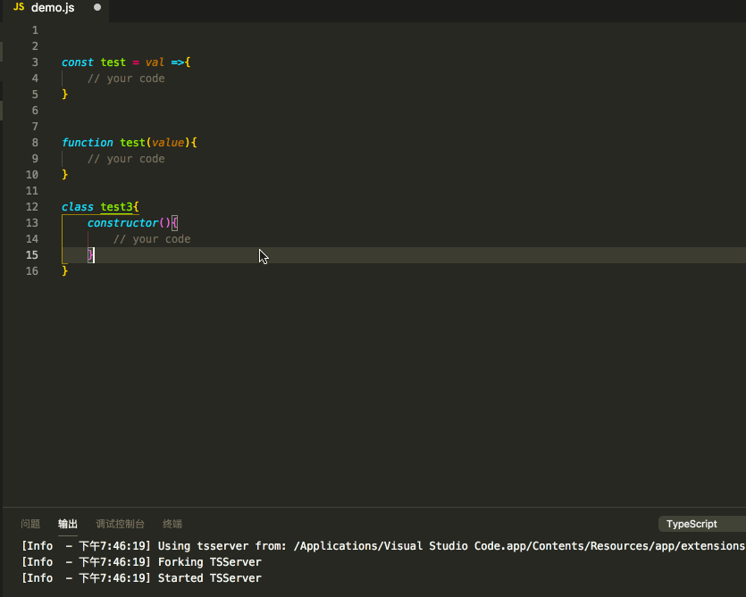
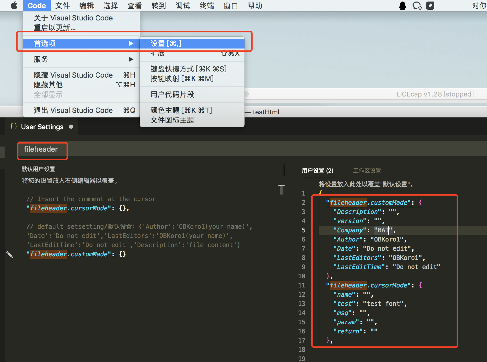
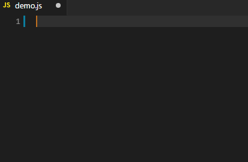

# koroFileHeader 

> Read a user-defined template, by adding the file header comments shortcuts, add function annotations at the cursor ` VsCode ` plug-in

## language

[简体中文](https://github.com/OBKoro1/koro1FileHeader/blob/master/README.md) | English

## changelog

[address](https://github.com/OBKoro1/koro1FileHeader/blob/master/CHANGELOG.md)

## Introduction to the

1. **Add comments to the file header**:
   
   *  Add comments at the beginning of the file to record the file information
   *  Read user Settings and generate comment templates
   *  When saving a file, automatically update the last edit time and editor
   *  shortcuts：`window`：`ctrl+alt+i`,`mac`：`ctrl+cmd+i`

2. **Add function comments at the cursor**:

    * An annotation template is automatically generated at the cursor, with examples below
    * Support user - defined file annotation templates
    * shortcuts：`window`：`ctrl+alt+t`,`mac`：`ctrl+cmd+t`
    * Be careful that the shortcut key is occupied

## The installation

Search in Vscode expand store ` koroFileHeader `, click install.

## use

1. File header annotation：

    Use the shortcut key in the current edit file:`window`：`ctrl+alt+t`/`mac`：`ctrl+cmd+t`,File header comments can be generated。
    
2. Function annotations：
   
    1. Place the cursor on the function line or place the cursor on a blank line above the function
    2. Use shortcuts`window`：`ctrl+alt+t`,`mac`：`ctrl+cmd+t`，You can generate function annotations。
    3. In fact, function annotations can be generated anywhere in the file, where you need to control them.

## Comment template Settings

* The default configuration:
  
  Search in the user preferences ` fileheader `, for the default configuration：

        "fileheader.customMade": {} // The head notes
        "fileheader.cursorMode": {} // Function annotations 

  If the user does not set, the header comment and function comment template are：

    

 * Custom template：
    
   1. In user Settings, search`fileheader`
   2. Copy the default configuration + modify the configuration and restart to take effect

      
      
    As above, generate comments：

        // File header annotation
        /*
         * @Description: 
         * @version: 
         * @Company: BAT
         * @Author: OBKoro1
         * @Date: 2018-10-15 20:59:57
         * @LastEditors: OBKoro1
         * @LastEditTime: 2018-10-15 20:59:57
         */
        // Function annotations
        /**
         * @name: 
         * @test: test font
         * @msg: 
         * @param {type} 
         * @return: 
         */

### Automatic update last edit time, editor：

To enable this feature, you need to fill in the appropriate properties in the preferences setting：

      "fileheader.customMade": {
        "Date": "Do not edit", // File creation time (unchanged)
        "LastEditors": "OBKoro1", // Editor at the end of the document
        "LastEditTime": "Do not edit" // 文件最后编辑时间
      }
      // Close the corresponding function without filling in the corresponding attribute

## Update edit time automatically

## The last

If you feel good, then give a [Star] (https://github.com/OBKoro1/koro1FileHeader) ⭐ ️ encourage me ~